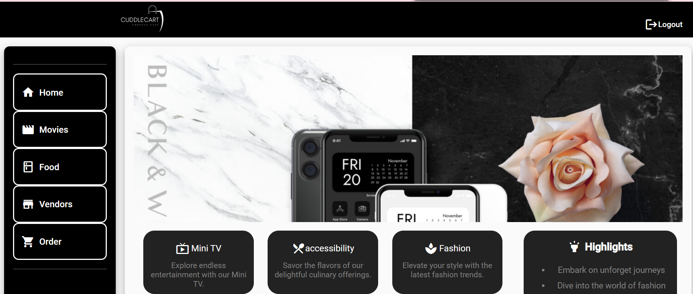
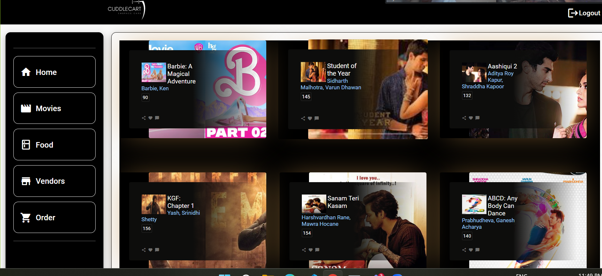
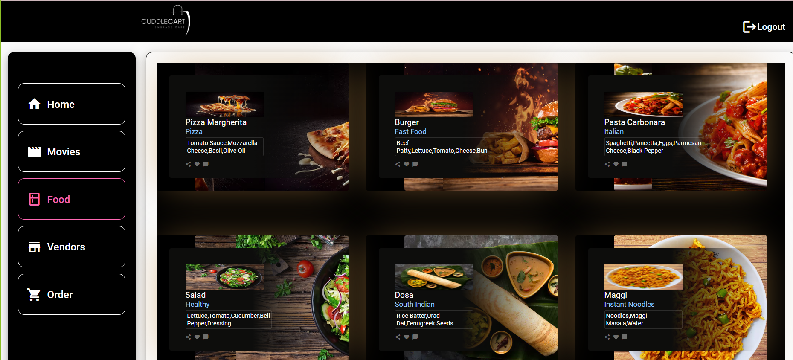
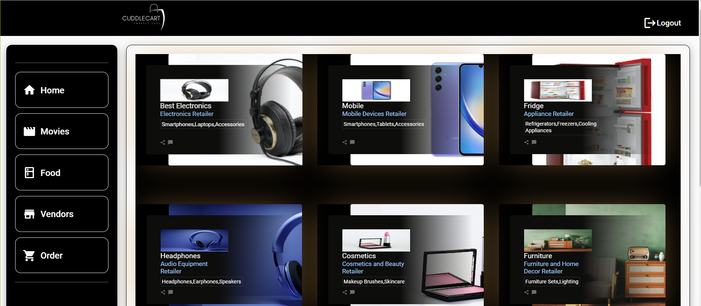
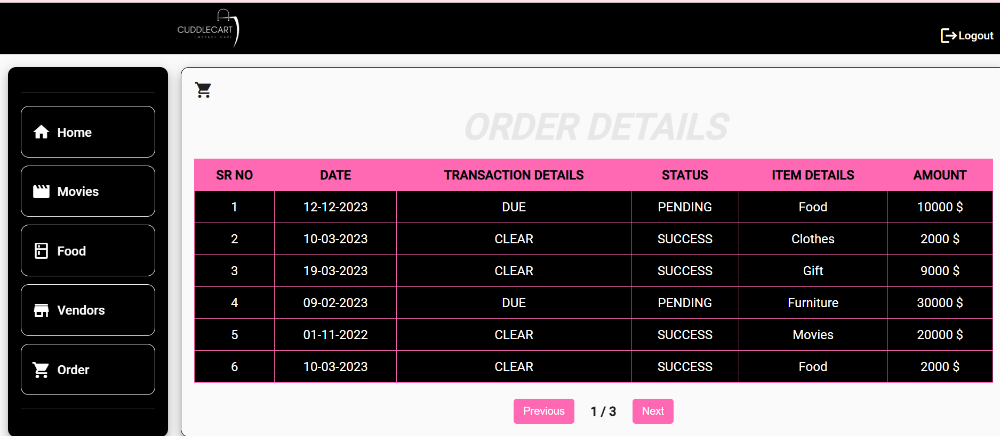

## Project 
  

## Angular
- Angular is a popular open-source web application framework for building dynamic, single-page web applications using HTML, CSS, and TypeScript.

## Project Name  
- CUDDLECART

## Requirements
- Node.js version v14.21.3
- Angular CLI requires a minimum of v16.13
-
 ## Techstacks 
 - Frontend: HTML, CSS, JavaScript (Angular), TypeScript

 | ANGULAR                                                                                                                         | TYPESCRIPT                                                                                                                      | HTML                                                                                                                        | SCSS                                                                                       | MATERIAL ICON                                                                                                                                                                                             |                                                                                                                                                                                                 |                                                                                                                                           |
| ------------------------------------------------------------------------------------------------------------------------------- | ------------------------------------------------------------------------------------------------------------------------------- | ------------------------------------------------------------------------------------------------------------------------------ | --------------------------------------------------------------------------------------------- | ------------------------------------------------------------------------------------------------------------------------------------------------------------------------------------------------------- | --------------------------------------------------------------------------------------------------------------------------------------------------------------------------------------------------- | ---------------------------------------------------------------------------------------------------------------------------------------------- |
|  |  |  |  |  |  |

 ## Pages/Components 
 - Home
 - Movies
 - Food
 - Ventors
 - Orders

## Movies 
 

## Food

 ## Vendors
 

 ## Orders
 